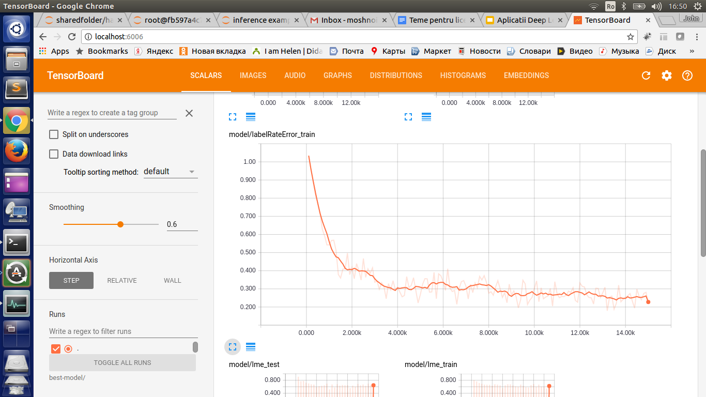
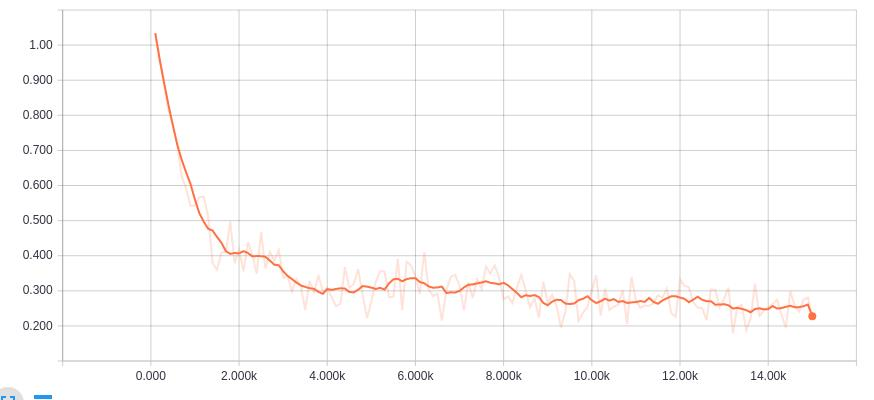

##Tensorflow implementation of handwritten sequense of small letter recognition.

The handwritten dataset used is IAM.

In order to run the training with multidimentional lstm: 
```
python train.py --slices 26 --width 12 --stride 3 --Bwidth 90 --train_data_pattern ../tf-data/handwritten-test-{}.tfrecords --train_dir separable_lstm --test_data_pattern ../tf-data/handwritten-test-{}.tfrecords  --max_steps 6000 --batch_size 20 --beam_size 3 --input_chanels 1 --model MDLSTMCTCModel --base_learning_rate 0.001 --num_readers 2 --export_model_steps 500 --display_step 10 --display_step_lme 100 --start_new_model
```

In order to see statistics in tensorboard:
```
tensorboard --logdir=separable_lstm --port=8080
```

<center>

label rate error for test images  
</center>

<center>

ctc loss for test images 
</center>


In order to see some prediction example checkout the jupyter notebook
